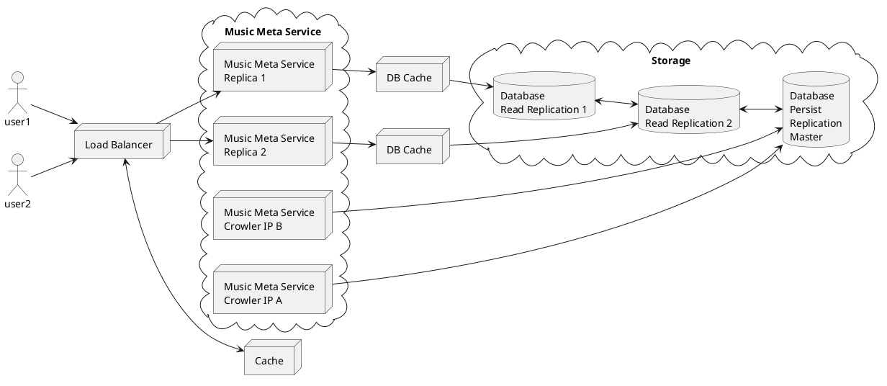

# Music Meta Service

Music Meta Service, is a REST API for providing clients with information about a specific music artist. The information
is collected from 3 different sources: MusicBrainz, Wikipedia and Cover Art Archive.

## Decision-Making Context

### Using Local Database

Since we are relying on our third-parties services, we will be limited by their service limits. MusicBrainz clearly limited
the request rate to one request per second, so we definitely are not able to fetch data and serve from that place. I 
decided to use a crawler to work in back-ground and fetch all the information in a local database to be able to serve
our api with a quick and low latency service.

### Using Query End-Point instead of Artist End-Point

We can save in the count of third-party end-point calls if we call query end-point to get the list of artists and at
the same time, save the main artists' properties. This is the way that crawler saves main artists' properties.

`http://musicbrainz.org/ws/2/artist/?query=type:person&offset=100&limit=100&fmt=json`

```json
{
    "created": "2022-03-24T14:59:28.621Z",
    "count": 1049082,
    "offset": 100,
    "artists": [
        {
            "id": "fd14da1b-3c2d-4cc8-9ca6-fc8c62ce6988",
            "type": "Person",
            "type-id": "b6e035f4-3ce9-331c-97df-83397230b0df",
            "score": 77,
            "gender-id": "36d3d30a-839d-3eda-8cb3-29be4384e4a9",
            "name": "Béla Bartók",
            "sort-name": "Bartók, Béla",
            "gender": "male",
            "country": "HU",
            "disambiguation": "composer",
            .
            .
            .
        
        },
        .
        .
        .
   ]
}
```

### Inaccurate Facts in Requirements

Based on the given example API, we can find a `relation` of type `wikipedia`. But apparently from 2015 MusicBrainz has 
started using `wikidata` instead. So it provides wikidata's entityId instead of artist's title. Here you can see the 
sample out put of calling 

`https://musicbrainz.org/ws/2/artist/f27ec8db-af05-4f36-916e-3d57f91ecf5e?fmt=json&inc=url-rels`

```json
{
  ...
  "relations": [
    ...
    {
      ...
      "type": "wikidata",
      "url": {
        "resource": "https://www.wikidata.org/wiki/Q2831",
        "id": "27011c1f-bd4f-474c-ae04-23e00f79ccd9"
      },
    },
    ...
  ]
}
```

So I decided to skip using this relation service and instead call wikipedia api directly with artist's full name which also
works correctly:

`https://en.wikipedia.org/w/api.php?action=query&format=json&prop=extracts&exintro=true&redirects=true&titles=Michael Jackson`

## Configuration

Application doesn't need any configuration for the experimental usage. 

- It has been configured to use the docker mysql server. For production usage we need to change the connection configuration based on the deployment design.
- Third-parties api calling is limited using `ratelimiter`. There you can test with other limit amounts at here: `resilience4j.ratelimiter.instances`
- In the rest api, an internal cache is configured to keep information for 15 minutes and for maximum 100000 items. The cache configuration can be find here: `spring.cache`
- The crawler will take a long  time to crawl through all the artists. For experimental usage the maximum amount of artists and albums are limited here: `crowler.max-artists-limit` and `crowler.max-albums-limit` 

## How to Run

### Start Docker

You need to have docker installed on the machine. In the command line from the root of the project run the following command:

```shell
docker compose up -d
```

It will start a mysql service on docker to act as our experimental database.

### Start Application

In the command line from the root of project run the following command:

```shell
mvn spring-boot:run
```

It will start the application and crawler will start crawling through the artists and their 
albums and accumulate the data in the local database.

### Call API

After a while when crawling is done, application is ready to serve. You can also call during the crawling process and if
a desired artist is not read yet, it will return not found (404).

example: `http://localhost:8081/musify/music-artist/details/1f9df192-a621-4f54-8850-2c5373b7eac9`

```json
{
    "mbid": "1f9df192-a621-4f54-8850-2c5373b7eac9",
    "name": "Ludwig van Beethoven",
    "gender": "male",
    "country": "DE",
    "disambiguation": "German composer",
    "description": "... was a German composer and pianist. Beethoven remains one of the most admired composers in the history of Western music; ...",
    "albums": [
        {
            "id": "0a176580-e9be-49ef-8424-4f6257a3bfa3",
            "title": "Complete Works for Flute and Piano"
        },
        {
            "id": "0db33ecd-ddef-4721-8877-7a4b2df993ca",
            "title": "Symphonies 1 & 8",
            "imageUrl": "http://coverartarchive.org/release/08903b2b-742d-4c9e-a5e8-048d29e1d690/15390502503.jpg"
        },
      ...
    ]
}
```

## Performance

Application has been designed to be used after crawling time, when all desired artists are inserted in the database. Then
application just loads them from database and serves the api. To make the performance even better, an application level
cache has been configured on top of the api service. 

The first time api call with a specific MBID takes around 170 ms on my local run experiment, though the next calls after content 
cached takes only 8 ms.

To achieve a production level solution, a specific deployment design is needed, please refer to the deployment design 
section.

## Deployment Design

In production level we need to consider more than one instance (replicas) to increase the availability and also to distribute the
load. So we consider more than one replica behind a load-balancer for our rest-api. In addition, considering a load-balancer
cache will show dramatic effects in increasing the performance. 

In storage level, we need to replicate our main database to some read-only purpose replication instances. So that api 
services only connect and read from the reading specific replications. In the same time crawlers are persisting to the
master replication. We can consider more than one crawler with different internet ip, so that we can fetch more data
from third-parties limited service.


